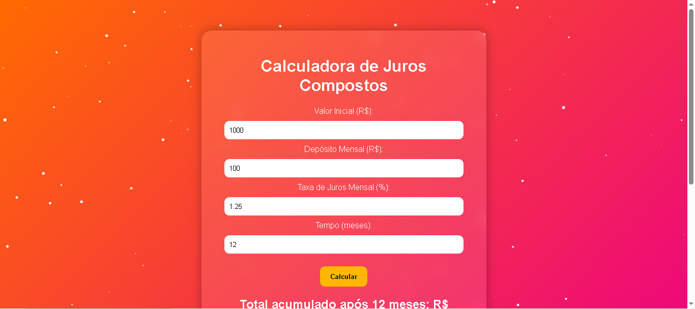
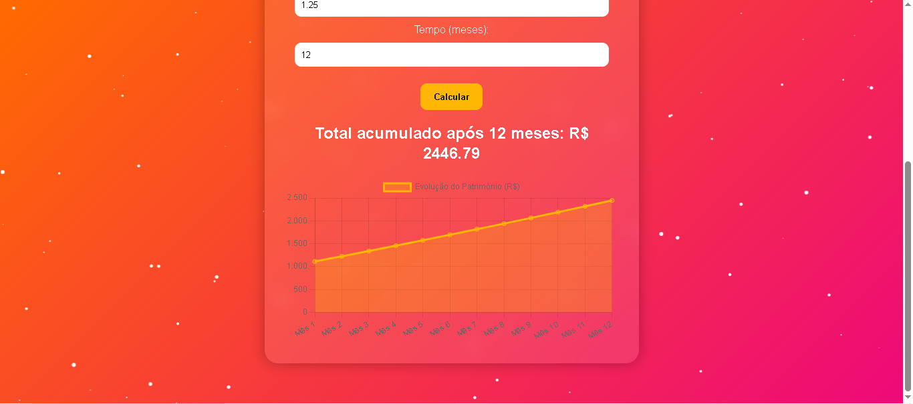

## 💰 Calculadora de Juros Compostos

Uma aplicação web interativa que calcula e exibe a evolução de um investimento com **juros compostos**.  
O projeto possui **gráfico dinâmico** e **fundo animado com efeito glassmorphism**.

## Funcionalidades

- Cálculo automático de juros compostos mês a mês
- Aporte inicial + depósitos mensais
- Exibição do **valor acumulado** ao final do período
- **Gráfico interativo** com Chart.js
- **Fundo animado** com partículas e efeito glassmorphism

## Demonstração




## Tecnologias Utilizadas

- **HTML**
- **CSS**
- **JavaScript**
- **Chart.js**
- **Canvas API**

## Acesso

Acesse o Projeto clicando [aqui](https://calculadora-juros-compostos-liard.vercel.app/)

## Como Executar Localmente

Se estiver no GitHub e quiser baixar:
- Clique em **Code** → **Download ZIP** e extraia em uma pasta no seu computador.
- Ou, se tiver Git, clone com:
- ```bash
  git clone https://github.com/Luizhenrique1304/Calculadora-Juros-Compostos.git
  ```

## Licença

Este projeto está sob a licença MIT.
